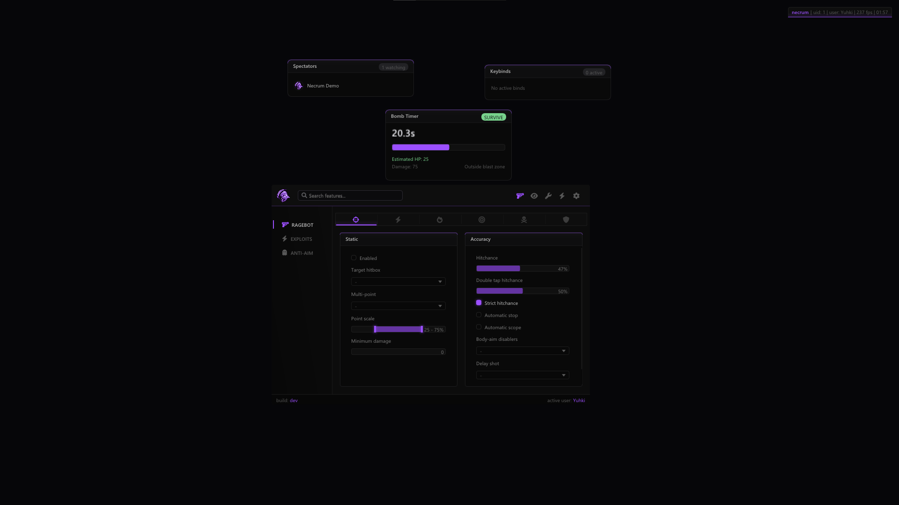

# Necrum ImGui

[](https://opensource.org/licenses/MIT)
[](https://en.wikipedia.org/wiki/C%2B%2B20)
[](https://xmake.io/)

A modern, feature-rich ImGui-based UI framework designed for Windows applications with support for multiple rendering backends including DirectX 9, DirectX 11, OpenGL, and Vulkan.

## ✨ Features

- **Multi-Renderer Support**: Seamless integration with DirectX 9, DirectX 11, OpenGL, and Vulkan
- **Modern C++20**: Built with the latest C++ standards for optimal performance
- **Rich Widget Library**: Comprehensive set of UI controls including color pickers, dropdowns, panels, and more
- **Theme System**: Customizable themes with smooth animations
- **Font Integration**: Built-in support for custom fonts and icons
- **Web Image Loading**: Direct loading of images from URLs
- **Hook System**: Advanced rendering hooks for various graphics APIs
- **Cross-Platform Ready**: Windows-focused with extensible architecture

## 🖼️ Screenshot Preview



> Example UI showing the multi-renderer menu and themed widgets.


## 🚀 Installation

### Prerequisites

- [xmake](https://xmake.io/) build system
- Windows 10 or later
- Visual Studio 2019+ or compatible C++ compiler

### Build

```bash
# Clone the repository
git clone https://github.com/yuhkix/necrum-imgui.git
cd necrum-imgui

# Install dependencies and build
xmake
```

### Targets

- `necrum` - Main binary application
- `necrum_gl` - OpenGL shared library (DLL)
- `necrum_dx9` - DirectX9 shared library (DLL)
- `necrum_dx11` - DirectX11 shared library (DLL)
- `necrum_vk` - Vulkan shared library (DLL)

## 📖 Usage

### Basic Integration

```cpp
#include "menu/menu.h"
#include "render/renderer.h"

// Initialize the renderer
Renderer::Initialize();

// Create and show your menu
Menu::Initialize();
Menu::Render();
```

### Renderer Selection

The framework automatically detects and uses the appropriate renderer based on your application's graphics API:

- **DirectX 9**: For D3D9 applications
- **DirectX 11**: For D3D11 applications
- **OpenGL**: For OpenGL-based applications
- **Vulkan**: For Vulkan applications

### Custom Widgets

```cpp
#include "widgets/ui_framework.h"

// Create a custom panel
auto panel = std::make_shared<Panel>("Settings");
panel->AddControl(std::make_shared<ColorPicker>("Accent Color"));
panel->AddControl(std::make_shared<Slider>("Opacity", 0.0f, 1.0f));
```

## 🏗️ Architecture

```
src/
├── core/           # Core utilities (image loading, etc.)
├── menu/           # Menu system and pages
├── render/         # Rendering backends and hooks
├── widgets/        # UI controls and framework
└── fonts/          # Font resources
```

## 🤝 Contributing

We welcome contributions! Please follow these steps:

1. Fork the repository
2. Create a feature branch (`git checkout -b feature/amazing-feature`)
3. Commit your changes (`git commit -m 'Add amazing feature'`)
4. Push to the branch (`git push origin feature/amazing-feature`)
5. Open a Pull Request

## 📄 License

This project is licensed under the MIT License - see the [LICENSE](LICENSE) file for details.

## 🙏 Acknowledgments

- [ImGui](https://github.com/ocornut/imgui) - The immediate mode GUI library
- [xmake](https://xmake.io/) - Modern C/C++ build system
- [stb](https://github.com/nothings/stb) - Single-file public domain libraries

---

*Built with ❤️*