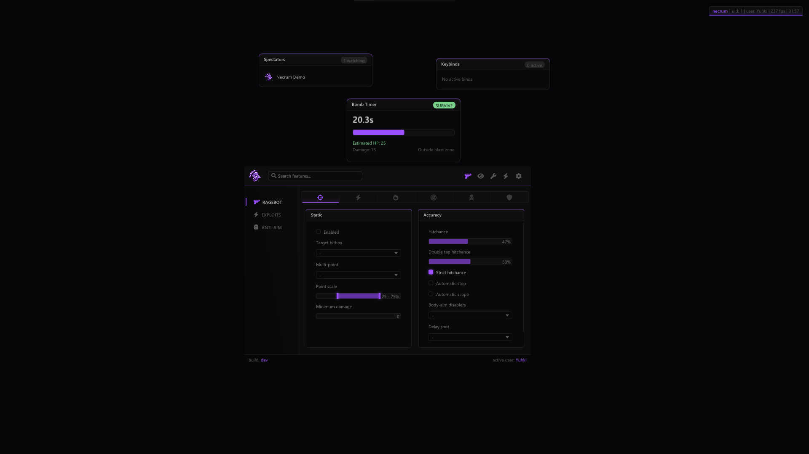

# Necrum ImGui

[](https://opensource.org/licenses/MIT)
[](https://en.wikipedia.org/wiki/C%2B%2B20)
[](https://xmake.io/)


An animated, themeable UI framework on top of [Dear ImGui](https://github.com/ocornut/imgui).
You register pages and write widgets; the framework provides the window shell, search,
animations, theming, overlays, notifications and config persistence. It runs on **Linux and Windows**:
as a desktop app (GLFW + OpenGL 3 on Linux, DirectX 11 on Windows) or, on Windows, as an injectable
overlay DLL for DirectX 9/10/11/12, OpenGL and Vulkan.




> The screenshot is the `game_menu` example. It used to be the whole project; it is now an ordinary
> app built on the framework, next to the generic `showcase` example.

## ✨ Features

- **App shell**: a complete main window (logo, search field, tab icons, sidebar pages, animated content, footer)
  from a few `add_tab` / `add_page` calls. Toggle with a key, drag, fade in/out.
- **Search built in**: every widget is filtered by its label automatically; the shell dry-runs all pages,
  dims tabs without hits and jumps to the best page. Extra keywords via `nc::search::tags(...)`.
- **Widgets**: checkbox, toggle switch, radio, buttons (4 styles), sliders, range sliders, segmented control,
  combo, multi-combo, list box, tab strip, text/int/float inputs, keybinds (toggle / hold / always),
  HSV(A) color picker with hex + copy/paste, progress bar, spinner, badges, plots, popups, confirm dialog.
- **Layout**: titled panels (auto height, fixed, or fill) with their own scrolling, and equal-width columns.
- **Theme tokens**: every color and metric comes from `nc::theme()`; presets *Necrum*, *Crimson*, *Graphite*,
  *Daylight* (light), live theme editor, frame-rate independent animations.
- **HUD**: draggable overlays (built-in keybind list), notifications/toasts, watermark, splash screen.
- **Config**: bind variables once, save/load/reset plain-text configs; ready-made config manager page.
- **Retained mode** (optional): build a node tree once (`nc::retained::Panel`, `Checkbox`, ...), draw it each frame.
- **Backend agnostic**: apps implement `nc::App`; backends only talk to `nc::host`.

## 🚀 Building

Requirements: [xmake](https://xmake.io/) ≥ 2.9 and a C++20 compiler.

| Platform | Compiler | Extra |
| --- | --- | --- |
| Linux | GCC 11+ / Clang 14+ | OpenGL driver, X11 or Wayland (GLFW is fetched by xmake, or `libglfw3-dev`) |
| Windows | Visual Studio 2019+ or MinGW-w64 | Windows 10 SDK |

```bash
git clone https://github.com/yuhkix/necrum-imgui.git
cd necrum-imgui
xmake                 # builds the framework + the standalone app
xmake run necrum      # opens the showcase
```

Pick which example is compiled in:

```bash
xmake f --app=game_menu   # or --app=showcase (default)
xmake && xmake run necrum
```

Cross-compile the Windows targets from Linux with MinGW:

```bash
xmake f -p mingw -a x86_64 -m release
xmake -a
```

### Targets

| Target | Platforms | Description |
| --- | --- | --- |
| `necrum_core` | all | Static library: Dear ImGui + the framework (`src/necrum`) |
| `necrum` | all | Standalone app (Linux: GLFW + OpenGL 3, Windows: DirectX 11) |
| `necrum_headless` | all | Headless fuzz test of the selected app (`xmake run necrum_headless [frames] [seed]`) |
| `necrum_dx9` … `necrum_dx12`, `necrum_gl`, `necrum_vk` | Windows | Injectable overlay DLLs (press **END** to unload) |

## 📖 Usage

```cpp
#include "necrum/necrum.h"

class MyApp final : public nc::App
{
public:
    MyApp()
    {
        nc::config().bind("general.vsync", &vsync_);
        nc::keybinds::track(&panic_, "Panic key");

        auto& general = shell_.add_tab("General", ICON_FA_GEAR);
        general.add_page("Display", ICON_FA_DESKTOP, [this] {
            nc::begin_columns(2);
            if (nc::begin_panel("Window", {0, -1}))       // fill the column height
            {
                nc::checkbox("VSync", &vsync_);
                nc::slider("Opacity", &opacity_, 0.0f, 1.0f, "%.0f%%", 100.0f);
                nc::keybind("Panic key", &panic_);
            }
            nc::end_panel();
            nc::next_column();
            if (nc::begin_panel("Theme", {0, -1}))
                nc::theme_editor();
            nc::end_panel();
            nc::end_columns();
        });
    }

    void frame() override
    {
        nc::keybind_overlay(true);
        shell_.render();
    }

    bool wants_input() const override { return shell_.is_open(); }

private:
    nc::Shell shell_{{.title = "my tool"}};
    bool vsync_ = true;
    float opacity_ = 1.0f;
    nc::Keybind panic_{ImGuiKey_End};
};

NC_REGISTER_APP(MyApp)
```

Put the file in `examples/my_app/` and build with `xmake f --app=my_app`.

### Retained mode

```cpp
using namespace nc::retained;
auto panel = std::make_shared<Panel>("Aimbot");
panel->add<Checkbox>("Enabled", &settings.enabled);                 // bound to your variable
panel->add<Slider>("FOV", 0.0f, 180.0f, 90.0f, "%.0f")               // owns its value
     .visible_if([&] { return settings.enabled; })
     .on_change([] { nc::notify(nc::Notify::Info, "FOV changed"); });
// every frame, e.g. inside a page:
panel->draw();
```

### Custom widgets

Everything the built-in widgets use is public: `nc::theme()` tokens, `nc::styled()` (respects window fade),
`nc::anim::animate(id, target)` for animation state, `nc::draw::glow/card/text_swap`, `nc::fonts::*`.
Call `nc::search::filter(label)` first so your widget takes part in search.
`examples/game_menu/esp_preview.cpp` is a large example of a fully custom interactive widget.

## 🏗️ Architecture

```
src/
├── necrum/                 # the framework (portable: only Dear ImGui + std)
│   ├── necrum.h            # umbrella header
│   ├── core/               # theme, color, anim, draw, fonts, input (keybinds), search, config, context
│   ├── widgets/            # immediate-mode widgets
│   ├── layout/             # panels, columns
│   ├── app/                # Shell, notifications, overlays, watermark, splash, built-in pages
│   ├── retained/           # retained-mode node tree
│   ├── platform/           # nc::App / nc::host bridge, debug console
│   ├── extras/             # async web images (WinINet on Windows)
│   └── fonts/              # embedded Font Awesome 6
├── render/                 # backends: standalone_glfw (Linux), standalone_dx11, Windows hooks + renderers
├── ext/                    # Dear ImGui 1.92.6 (+ GLFW backend), MinHook
├── main.cpp                # standalone entry (all platforms)
└── dllmain.cpp             # injectable DLL entry (Windows)
examples/
├── showcase/               # framework tour, template for new apps
└── game_menu/              # the original necrum menu rebuilt on the framework
tests/
└── headless.cpp            # GPU-less fuzz test (catches ImGui assertion failures)
```

## 🤝 Contributing

1. Fork the repository
2. Create a feature branch (`git checkout -b feature/amazing-feature`)
3. Commit your changes (`git commit -m 'Add amazing feature'`)
4. Push to the branch (`git push origin feature/amazing-feature`)
5. Open a Pull Request

Please run `xmake build necrum_headless && xmake run necrum_headless` before submitting UI changes.

## 📄 License

This project is licensed under the MIT License - see the [LICENSE](LICENSE) file for details.

## 🙏 Acknowledgments

- [Dear ImGui](https://github.com/ocornut/imgui) - The immediate mode GUI library
- [GLFW](https://www.glfw.org/) - Windowing on Linux
- [MinHook](https://github.com/TsudaKageyu/minhook) - Function hooking on Windows
- [xmake](https://xmake.io/) - Modern C/C++ build system
- [stb](https://github.com/nothings/stb) - Single-file public domain libraries
- [Font Awesome](https://fontawesome.com/) - Icons

---

*Built with ❤️*
